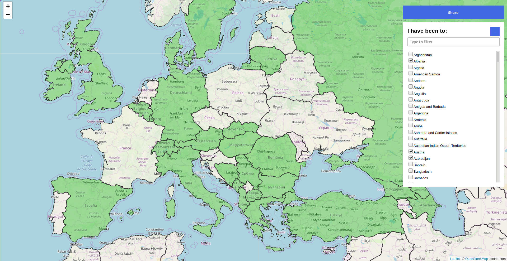

# I have been to...

> Online map that shows the countries one have visited


## Install

Just clone the repository. No build, no preprocessing, no install.
```
git clone https://github.com/suricactus/i-have-been-to.git
```

## Demo

[Demo and Application](https://suricactus.github.io/i-have-been-to)

## Contributing

PRs accepted.

## License

[MIT](../LICENSE) © Ivan Ivanov - suricactus
